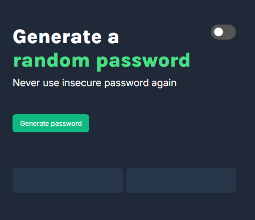
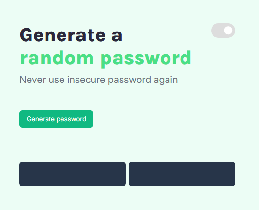
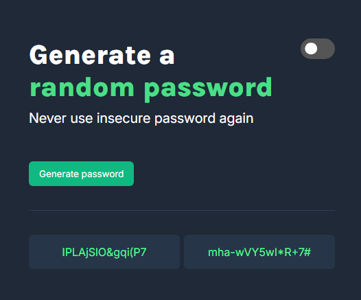
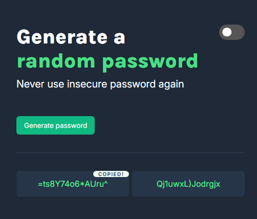

# Simple password generator

This is a project from [Scrimba course](https://scrimba.com/frontend-path-c0j)
### Screenshot

## Table of contents

-   [Screenshot](#screenshot)
-   [Overview](#overview)
    -   [The challenge](#the-challenge)
    -   [Links](#links)
-   [My process](#my-process)
    -   [Built with](#built-with)

## Overview

A simple password generator with the ability to switch between dark and light themes, and the option to copy the generated password by clicking on the password field.

### The challenge

Users should be able to:

-   Generate random password
-   Toggle theme
-   Copy password by clicking on it

### Links

-   Live Site URL: [live site](https://lukaszmateuszsobczak.github.io/frontEndMentor-Product-preview-card-component/)

### Built with

-   Semantic HTML5 markup
-   CSS custom properties
-   Flexbox
-   Pseudo elements

